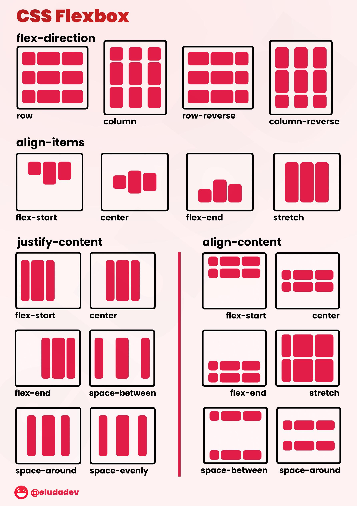
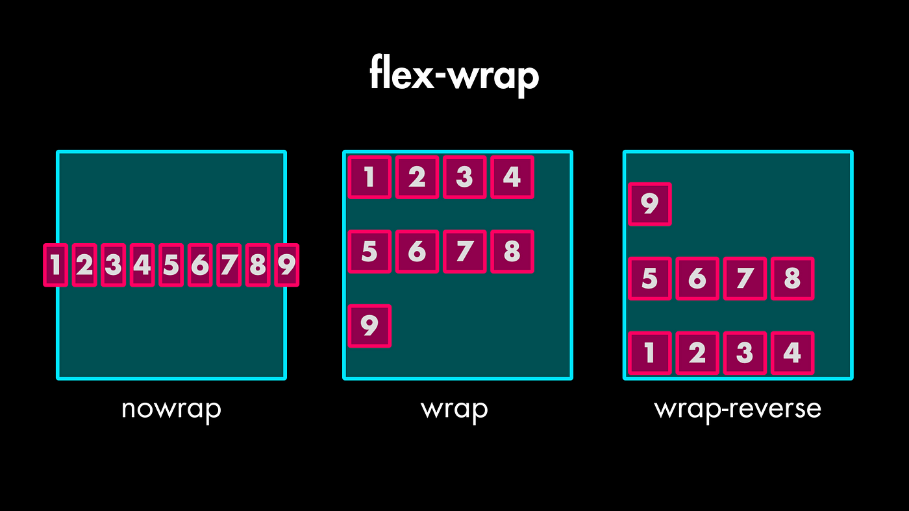

# CSS 

# 📚 **Table des matières**

---

**[La structure du CSS](#la-structure-du-css)**  
**[Insérer le CSS dans le HTML](#insérer-le-css-dans-le-html)**   
<<<<<<< HEAD
**[Les sélecteurs](#Les-sélecteurs)**  
=======
**[Classes, IDs et sélecteurs](#classes-pseudo-classes-éléments-pseudo-éléments-ids-et-le-sélecteur-universel)**  
>>>>>>> 8e04e1e5d67444ecd7c307afa241d911bbc19baf
**[Le Box Model](#le-box-model)**  
**[Le Positionnement en CSS](#le-positionnement-en-css)**  
**[La Spécificité en CSS](#la-spécificité-en-css)**  
**[Manipuler les Polices](#manipuler-les-polices)**  
**[Google Fonts et Polices Externes](#google-fonts)**  

---

 **[La notion de cascade en CSS](#la-notion-de-cascade-en-css)**  
 **[L'héritage en CSS](#lheritage)**  
 **[Flexbox](#flexbox)**  
 **[Introduction à CSS Grid](#introduction-a-css-grid)**  
 **[Les combinateurs](#les-combinateurs)**  
 **[Préprocesseur CSS](#préprocesseur)**

---

💡 *Note*: Chaque section ci-dessus renvoie à un chapitre détaillé pour approfondir tes connaissances sur le CSS. Navigue directement en cliquant sur les liens !
   

## La structure du css


Chaque déclaration CSS est composée d’une propriété et d’une valeur. La propriété définit ce qui va être stylisé, et la valeur spécifie comment.

Voici quelques propriétés courantes :
```css
    color : définit la couleur du texte.

    background-color : définit la couleur de fond.

    font-size : définit la taille du texte.
```
## Insérer le CSS dans le HTML

### Il existe 4 manières:

#### 1. __CSS en ligne (inline CSS)__ : 

Le CSS en ligne consiste à appliquer des styles directement dans l'élément HTML via l'attribut style. Cela permet de cibler un seul élément spécifique sur la page.

Quand l'utiliser ?

- Utile pour appliquer rapidement un style à un élément précis.

- Moins conseillé pour des projets à grande échelle car il peut rendre le code moins lisible et difficile à maintenir.

```CSS
<p style="color: red; font-size: 20px;">Ce texte est rouge et en taille 20px.</p>
```
Dans cet exemple, l'élément ```<p>``` aura une couleur rouge et une taille de police de 20px.

#### 2. __CSS interne (internal CSS)__:

Le CSS interne consiste à inclure les styles directement dans le document HTML à l'intérieur de la balise ```<style>```, qui se trouve dans l'en-tête ```<head>``` du fichier HTML. Cette méthode est idéale si tu souhaites appliquer des styles à une seule page web.

Quand l'utiliser ?

- Lorsque tu veux appliquer des styles à une seule page HTML sans avoir à créer un fichier CSS externe.

- Convient pour des pages relativement simples où le code ne devient pas trop lourd.
```html css
<!DOCTYPE html>
<html lang="fr">
<head>
    <meta charset="UTF-8">
    <title>Exemple CSS interne</title>
    <style>
        body {
            background-color: lightblue;
        }
        h1 {
            color: green;
        }
    </style>
</head>
<body>
    <h1>Bonjour le monde !</h1>
</body>
</html>
```
Ici, les styles définis dans la balise ```<style>``` s'appliquent à toute la page HTML :

- Le fond de la page sera bleu clair.

-  Le titre ```<h1>``` sera en vert.

#### 3. __CSS externe (external CSS)__ :


Le __CSS externe__ consiste à placer les styles dans un fichier séparé, puis à lier ce fichier CSS à la page HTML avec la balise ```<link>``` dans l'en-tête. Cette méthode est la plus courante, surtout pour des projets plus complexes, car elle permet de séparer la structure du contenu (HTML) et la présentation (CSS).

Quand l'utiliser ?

   - Pour des projets de grande envergure où tu veux appliquer les mêmes styles à plusieurs pages.

- Cela permet de garder le code HTML propre et facile à maintenir.

```css
<link rel="stylesheet" href="style.css">
```
#### 4. __CSS via @import dans une feuille de style__: 


La règle ```@import``` est utilisée dans un fichier CSS pour importer un autre fichier CSS. Cela permet de diviser les styles en plusieurs fichiers CSS et de les organiser de manière plus logique.

Quand l'utiliser ?

- Lorsque tu veux organiser ton CSS en plusieurs fichiers.

- Utile si tu veux importer des feuilles de style communes dans d'autres feuilles de style.

Exemple :

- Fichier CSS principal (main.css) : 
```css
@import url('style.css');

body {
    font-family: Arial, sans-serif;
}
```
- Fichier CSS importé (style.css):
```css
h1 {
    color: red;
}
```
Dans cet exemple, le fichier main.css importe le fichier style.css, et le style contenu dans ce dernier s'appliquera à la page web. Cependant, l'utilisation de @import peut affecter la performance du chargement de la page, car les fichiers sont chargés séquentiellement.


| Méthode              | Description | Cas d’utilisation |
|----------------------|-------------|-------------------|
| **Inline CSS**        | Styles ajoutés directement dans l'élément via l'attribut `style`. | Petits changements rapides à un seul élément. |
| **Internal CSS**      | Styles ajoutés dans la balise `<style>` dans l’en-tête de la page HTML. | Utilisé pour des pages simples ou un projet spécifique. |
| **External CSS**      | Styles définis dans un fichier séparé et reliés via `<link>`. | Idéal pour des projets à grande échelle et réutilisables. |
| **`@import`**         | Permet d'importer un fichier CSS dans un autre fichier CSS. | Organiser et modulariser les styles dans de nombreux fichiers. |

## Les sélecteurs


### 1. Classes (.) :

Les classes permettent d'appliquer un même style à plusieurs éléments. Elles sont définies avec un . suivi du nom de la classe.

Exemple :
```
<p class="important">Texte important</p>
<p class="important">Autre texte important</p>
```
```css
.important {
    color: red;
    font-weight: bold;
}
```

✔ Utilité : Réutilisation du style sur plusieurs éléments.

❌ Inconvénient : Ne doit pas être utilisée pour des éléments uniques (préférer id dans ce cas).

### 2. IDs (#)

Les IDs sont uniques et doivent être utilisés pour un seul élément par page. Ils sont définis avec # suivi du nom de l'ID.
Exemple :
```html
<h1 id="main-title">Titre Principal</h1>
```
```css
#main-title {
    font-size: 24px;
    text-align: center;
}
```
✔ Utilité : Identifier un élément unique pour lui appliquer un style spécifique.

❌ Inconvénient : Non réutilisable et moins flexible que les classes.

⚠ Bonne pratique : Utiliser les classes (.) pour le styling et les IDs (#) uniquement pour des interactions avec JavaScript ou des ancres HTML.

### 3. Sélecteurs d'éléments (ou de balises)

Les sélecteurs d'éléments ciblent directement une balise HTML sans utiliser de classe ou d’ID.
Exemple :
```css
p {
    color: blue;
}
```

__Ce style s'applique à tous les ```<p>``` de la page.__

✔ Utilité : Rapide et simple à appliquer à tous les éléments d’un même type.

❌ Inconvénient : Pas assez spécifique si on veut styliser certains éléments seulement.

### 4. Pseudo-classes (:)

Les pseudo-classes permettent de sélectionner un état particulier d’un élément sans modifier le HTML.
Exemples courants :
```css
a:hover {
    color: red;
} 
```
```
    :hover → S'applique quand la souris survole un élément.

    :focus → Quand un champ de formulaire est sélectionné.

    :nth-child(odd) → Sélectionne les enfants impairs d'un parent.

    :first-child → Sélectionne le premier enfant d'un élément parent.
```

✔ Utilité : Permet d’ajouter des interactions et effets dynamiques.

❌ Inconvénient : Dépend du comportement de l’utilisateur

### 5. Pseudo-éléments (::)

Les pseudo-éléments permettent de styliser une partie spécifique d'un élément.

Exemples :

```css
p::first-letter {
    font-size: 2em;
    color: red;
}
```
Cela stylise uniquement la première lettre de chaque <p>.

```css
p::before {
    content: "🔥 ";
}
```
Cela ajoute un emoji 🔥 avant chaque <p>.

✔ Utilité : Ajouter des styles avancés sans modifier le HTML.

❌ Inconvénient : Moins compatible sur les anciens navigateurs.

### 6. Le Sélecteur Universel (*)

Le sélecteur universel (*) cible tous les éléments d'une page.
Exemple :
```css
* {
    margin: 0;
    padding: 0;
    box-sizing: border-box;
}
```
Cela permet souvent de réinitialiser les styles par défaut.

✔ Utilité : Utile pour des reset CSS globaux.

❌ Inconvénient : Peut affecter tous les éléments, donc doit être utilisé avec précaution.

| **Type de Sélecteur**  | **Syntaxe** | **Description** | **Exemple** |
|----------------------|-------------|-----------------|-------------|
| **Classe** | `.nom-classe` | Réutilisable, appliqué à plusieurs éléments | `.important { color: red; }` |
| **ID** | `#nom-id` | Unique, appliqué à un seul élément | `#main-title { text-align: center; }` |
| **Élément** | `balise` | Appliqué à toutes les occurrences de l'élément | `p { font-size: 16px; }` |
| **Pseudo-classe** | `:nom` | Sélectionne un état spécifique d'un élément | `a:hover { color: blue; }` |
| **Pseudo-élément** | `::nom` | Cible une partie spécifique d'un élément | `p::first-letter { color: red; }` |
| **Sélecteur Universel** | `*` | Sélectionne **tous** les éléments | `* { margin: 0; }` |

## Le box model


- __Le Contenu (content)__ : L’intérieur de la boîte où le texte ou les images apparaissent.

- __Le Remplissage (padding)__ : L’espace entre le contenu et la bordure.

- __La Bordure (border)__ : L’encadrement autour du contenu et du padding.

- __La Marge (margin)__ : L’espace extérieur qui sépare l’élément des autres éléments.

le Box Model est essentiel pour :

- Maîtriser l’espace entre les éléments.

- Aligner correctement les éléments sur une page.

- Éviter les bugs d’affichage causés par des tailles qui dépassent.

En résumé : 

✅ Tous les éléments HTML sont des boîtes.

✅ Ces boîtes suivent une structure (content, padding, border, margin).

✅ box-sizing: border-box; permet de mieux gérer la taille des éléments.

## Le positionnement en CSS

Le positionnement en CSS permet de contrôler l’endroit où un élément apparaît sur la page. 

__Il existe 5 types de positionnement principaux:__

### 1. Position static (par défaut):

- Comportement : Les éléments apparaissent dans l’ordre du flux normal du document.

-  Quand l’utiliser ? : C’est le comportement par défaut, pas besoin de le spécifier.
```css
.box {
    position: static; /* Par défaut */
}
```
 Effet : L’élément reste empilé normalement les uns en dessous des autres.

 ### 2. Position relative

- Comportement : Déplacé par rapport à sa position de base (pensé à l'exemple du carré en pointillé).
-  Quand l’utiliser ? : Pour décaler légèrement un élément tout en conservant son espace d’origine.
```css
.box {
    position: relative;
    top: 20px; /* Descend de 20px */
    left: 10px; /* Se décale vers la droite de 10px */
}
```
Effet : L’élément est décalé, mais son espace d’origine reste vide.
### 3.Position absolute

- Comportement : L'élément se place par rapport au pixel 0.

- Quand l’utiliser ? : Pour placer précisément un élément sans affecter les autres.
```css
.container {
    position: relative; /* Référence */
}

.box {
    position: absolute;
    top: 20px; /* 20px du haut du .container */
    right: 50px; /* 50px de la droite du .container */
}
```
 Effet : L’élément se place exactement par rapport à .container, sans impacter les autres.

 ### 4.Position fixed

- Comportement : L’élément est fixé par rapport à la fenêtre du navigateur (viewport).

- Quand l’utiliser ? : Pour créer des menus fixes ou des boutons "Retour en haut".
```css
.box {
    position: fixed;
    bottom: 10px;
    right: 10px;
}
```

 Effet : L’élément reste visible même en scrollant.

### 5. Position sticky

- Comportement : L’élément est comme static au départ, puis devient fixed lorsqu’on scroll.
- Quand l’utiliser ? : Pour un menu collant qui reste visible quand on fait défiler.

```css
.box {
    position: sticky;
    top: 0; /* Reste collé en haut */
    background-color: yellow;
}
```
Effet : L’élément reste en haut de la page lorsqu'on scrolle.

| Position   | Effet |
|------------|----------------------------------------------------------------|
| **static**  | Position normale (par défaut), l'élément suit le flux du document. |
| **relative** | L'élément peut être déplacé par rapport à sa position normale. |
| **absolute** | L'élément se place par rapport au pixel 0. |
| **fixed**    | L'élément est fixé par rapport à la fenêtre du navigateur et ne bouge pas en scrollant. |
| **sticky**   | L'élément agit comme `static` au départ, puis devient `fixed` en scrollant. |

## La spécificité en css

La spécificité CSS permet de savoir quelle règle CSS s'applique lorsqu'il y a des conflits entre plusieurs styles. C’est un système de points qui donne plus d’importance à certaines règles qu’à d’autres.

### Règles de base de la spécificité

- L’ordre d’application → Si deux règles ont la même spécificité, la dernière écrite (plus bas dans le CSS) est appliquée.

- Les sélecteurs les plus précis sont prioritaires sur les sélecteurs plus généraux.

-  !important > Inline styles > ID > Classe / Attributs / Pseudo-classes > Éléments

### Pourquoi cet ordre ?

- Plus un sélecteur est précis et ciblé, plus il a de poids.
- Un ID est unique, une classe est réutilisable, un élément est générique.
- Le style en ligne est appliqué directement, donc il est prioritaire.
- Le sélecteur universel (*) est trop large, donc il n'a aucun poids.

### L’ordre exact de spécificité CSS est :

- !important (priorité absolue, mais ne fait pas partie du calcul de la spécificité).

- Style en ligne (style="") → 1000 points

- ID (#monID) → 100 points

- Classes, attributs et pseudo-classes (.maClasse, [type="text"], :hover) → 10 points

- Éléments et pseudo-éléments (div, p, h1, ::before) → 1 point

- Sélecteur universel (*) → 0 point (aucune spécificité)


## Manipuler les polices 

### Les tailles de polices 

#### Valeurs relatives

En gras = les plus important pour le responsive 

  __%__ → Pourcentage par rapport à la taille de police de l’élément parent.

    em → Multiplicateur de la taille de police de l’élément parent. 16px par défaut (ex. 2 em = 2 fois la taille parent, ex: élément parent: 16px, 2em= 36px ).

   __rem__ → Multiplicateur basé sur la taille de police de l’élément racine (<html>). par défaut: 16px (mettre font size: 10px au début pour que se soit plus simple à calculer)

  __vw et vh__ → Proportion de la largeur/hauteur de la fenêtre d'affichage (viewport). (= 1% de la largeur/hauteur du viewport)

    ex → Basé sur la hauteur de la lettre "x".

#### Unités fixes

    px → Pixels, taille fixe sur l’écran.

| Propriété      | Description                                      | Exemple                                      |
|----------------|--------------------------------------------------|----------------------------------------------|
| `font-family`  | Définit la police à utiliser.                    | `font-family: "Arial", sans-serif;`          |
| `font-size`    | Définit la taille de la police.                  | `font-size: 16px;`                           |
| `font-weight`  | Définit l'épaisseur du texte.                    | `font-weight: bold;`                         |
| `font-style`   | Définit le style de la police (normal, italique).| `font-style: italic;`                        |
| `line-height`  | Définit l'espacement entre les lignes de texte.  | `line-height: 1.5;`                          |
| `letter-spacing`| Définit l'espacement entre les lettres.         | `letter-spacing: 2px;`                       |
| `@font-face`   | Permet d'importer une police externe.            | `@font-face { font-family: 'MaPolice'; src: url('chemin'); }` |
| `font-variant` | Permet d'utiliser des variantes typographiques.  | `font-variant: small-caps;`                  |

## Google fonts

Google Fonts est un service qui permet d'intégrer facilement des polices web gratuites et ouvertes dans des projets.

### Intégrer des polices extérieurs 

### importer une police depuis Google Fonts
C'est la méthode la plus facile. Elle consiste à importer une police __depuis Google Fonts__ en ajoutant un lien dans le ```<head>``` du fichier HTML.

Étapes :

- Aller sur Google Fonts.

- Choisir une police et copier le lien fourni.

- L’ajouter dans le ```<head>``` du fichier HTML.

### @font-face pour importer une police personnalisée

Si vous avez un fichier de __police (.woff, .woff2, .ttf)__, vous pouvez l’intégrer avec __@font-face__.

Étapes :

- Télécharger la police et placer les fichiers dans votre projet.

- Déclarer la police avec @font-face en CSS.

- Utiliser la police dans les styles.

  Exemple :

Si la police est MaPolice.woff2 et est stockée dans un dossier fonts/ :
```css
@font-face {
  font-family: 'MaPolice';
  src: url('fonts/MaPolice.woff2') format('woff2'),
       url('fonts/MaPolice.woff') format('woff');
  font-weight: normal;
  font-style: normal;
}

body {
  font-family: 'MaPolice', sans-serif;
}
```

 Avantages : Fonctionne sans dépendre d'un service externe.

 Inconvénient : Augmente le poids du site si la police est trop lourde.

 ### Importer une police via un CDN

 Certaines polices sont hébergées sur des CDNs (Content Delivery Network), ce qui évite de stocker le fichier localement.

 Exemple avec Fontsource (équivalent à Google Fonts en local) :

Ajoutez cette ligne dans votre CSS :
```css
@import url('https://fonts.googleapis.com/css2?family=Montserrat:wght@300;700&display=swap');
```
## la notion de cascade en CSS

En CSS, la cascade est un concept fondamental qui détermine quelle règle CSS s'applique lorsqu'il y a plusieurs déclarations qui ciblent le même élément. La cascade suit un ensemble de règles de priorité qui permettent de trancher en cas de conflit.

| Principe                     | Description                                                                 | Exemple                                       |
|------------------------------|-----------------------------------------------------------------------------|-----------------------------------------------|
| **L’origine des styles**      | Détermine d'où vient la règle CSS : navigateur, feuille CSS de l'utilisateur, CSS de l'auteur (vous). | Les styles du navigateur sont par défaut (`<h1>` en gras). |
| **La spécificité des sélecteurs** | Plus un sélecteur est précis, plus il a de poids.                        | `#id` > `.classe` > `balise`                 |
| **L’ordre d’apparition**      | En cas d’égalité, la dernière règle déclarée l’emporte.                    | Si deux règles ont la même spécificité, celle qui vient en dernier s’applique. |

- La cascade permet de gérer les conflits entre plusieurs règles CSS.
- La spécificité joue un rôle clé pour déterminer quelle règle s’applique.
- L’ordre d’apparition influence le style si les règles ont la même spécificité.
- !important peut écraser toutes les règles, mais doit être utilisé avec précaution.

## L'heritage 

L'héritage en CSS est le mécanisme qui permet aux éléments enfants de récupérer automatiquement certaines propriétés définies pour leur parent, notamment les styles liés au texte comme `color` et `font-family`. Il peut être forcé avec `inherit` ou annulé avec `initial` et `unset`.

| Mot-clé    | Comportement |
|------------|-------------|
| **`inherit`** | Fait hériter la valeur du parent, même si la propriété ne s'hérite pas naturellement. |
| **`initial`** | Réinitialise la propriété à sa **valeur par défaut** du navigateur. |
| **`unset`** | Se comporte comme `inherit` pour les propriétés héritables, et comme `initial` pour les autres. |


| Concept | Définition | Exemple |
|---------|------------|---------|
| Héritage | Les enfants récupèrent certaines propriétés du parent (ex: `color`, `font-family`). | `<p>` hérite la couleur définie dans `<body>`. |
| Cascade | Priorité entre plusieurs styles en fonction de leur spécificité et ordre d'apparition. | Un `h1` rouge peut être écrasé par un `h1 { color: blue; }` ajouté après. |

- L'héritage s'applique surtout aux propriétés textuelles (comme color).
- On peut forcer l’héritage avec inherit, ou le bloquer avec initial.
- L'héritage simplifie le CSS, mais doit être compris pour éviter les erreurs.

## Flexbox

Flexbox (Flexible Box) est un modèle de mise en page CSS qui facilite l'alignement et la distribution des éléments dans un conteneur, même si la taille des éléments est inconnue ou dynamique. Il est particulièrement utile pour créer des mises en page réactives.

### Activer Flexbox

Pour utiliser Flexbox, on applique `display: flex;` sur un élément parent.

### Aligner les éléments

🔸 Sur l'axe principal `justify-content`

Gère __l’alignement horizontal__ des éléments.
```css
.container {
  justify-content: center; /* Centre les boîtes */
}
```

Autres valeurs utiles :

__flex-start__ ➝ Aligné à gauche.

__flex-end__ ➝ Aligné à droite.

__space-between__ ➝ Espacement maximal.

__space-around__ ➝ Espacement équilibré.

__space-evenly__ ➝ Espacement uniforme.

### align-items

Gère __l’alignement vertical__ des éléments.
```css
.container {
  align-items: center; /* Centre verticalement */
}
```
Autres valeurs utiles :

__flex-start__ ➝ Aligné en haut.

__flex-end__ ➝ Aligné en bas.

__stretch__ ➝ Étire les éléments.

__baseline__ ➝ Aligne sur la ligne de base du texte.





## Introduction à CSS Grid

**CSS Grid** est un système de mise en page en deux dimensions qui permet d'organiser des éléments sous forme de grille, avec des colonnes et des lignes.

##  1. Activer CSS Grid
Pour utiliser **CSS Grid**, appliquez `display: grid;` à un conteneur :  

```css
.container {
  display: grid;
}
```

Tout élément **enfant** de ce conteneur sera positionné dans la grille.

---

## 📏 2. Définir une grille

###  a) Définir les colonnes et les lignes
Utilisez `grid-template-columns` et `grid-template-rows` :  

```css
.container {
  display: grid;
  grid-template-columns: 100px 200px 100px; /* 3 colonnes */
  grid-template-rows: 150px 150px; /* 2 lignes */
}
```

- Ici, la grille a **3 colonnes** (100px, 200px, 100px) et **2 lignes** (150px, 150px).

📌 **Astuce :** Utilisez `fr` (fraction) pour un partage équitable de l’espace :  

```css
.container {
  display: grid;
  grid-template-columns: 1fr 2fr 1fr; /* La 2e colonne est deux fois plus large */
}
```

---

## 3. Positionner les éléments

Par défaut, les éléments se placent automatiquement. Mais vous pouvez les positionner précisément avec `grid-column` et `grid-row` :

```css
.item {
  grid-column: 1 / 3; /* Occupe de la colonne 1 à 3 */
  grid-row: 1 / 2; /* Occupe la première ligne */
}
```

Ou plus simplement :

```css
.item {
  grid-column: span 2; /* Occupe 2 colonnes */
}
```

---

## 4. Espacement et alignement

###  a) Espacer les éléments
Utilisez `gap` pour ajouter un espace entre les cellules :

```css
.container {
  display: grid;
  grid-template-columns: repeat(3, 1fr);
  gap: 10px; /* 10px d’espace entre les éléments */
}
```

### b) Aligner les éléments
Vous pouvez aligner les éléments dans leur cellule avec :  

- `justify-items` : horizontalement (`start`, `center`, `end`, `stretch`)
- `align-items` : verticalement  
- `place-items` : combine les deux  

Exemple :

```css
.container {
  justify-items: center;
  align-items: center;
}
```

Pour **aligner tout le conteneur** :

```css
.container {
  justify-content: center;
  align-content: center;
}
```


### Grid vs flexbox

| **Grid** | **Flexbox** |
|----------|------------|
| 2D (lignes + colonnes) | 1D (soit lignes, soit colonnes) |
| Idéal pour les mises en page complètes | Idéal pour aligner des éléments sur une seule ligne |
| Positionnement précis | Disposition plus fluide |


## Les combinateurs 

### Le combinateur enfant (>)

Il sélectionne uniquement les enfants directs d'un élément.

Exemple :
```css
.container > p {
    color: red;
}
```
HTML correspondant :

```html 
<div class="container">
    <p>Texte en rouge</p> <!-- ✅ Sélectionné -->
    <div>
        <p>Texte normal</p> <!-- ❌ Non sélectionné (pas un enfant direct) -->
    </div>
</div>
```

- Seul le <p> directement à l'intérieur de .container est affecté.

### Le combinateur adjacent (+) (frère adjacent)

Il sélectionne un élément immédiatement suivant un autre.

Exemple :
```css
h1 + p {
    color: blue;
}
```
HTML correspondant :
```html
<h1>Titre</h1>
<p>Ce paragraphe sera bleu</p> <!-- ✅ Sélectionné -->
<p>Celui-ci ne sera pas affecté</p> <!-- ❌ Non sélectionné -->
```

 Le `<p>`qui suit immédiatement un `<h1>` est affecté.

 ### Le combinateur général (~) (général de frères)

Il sélectionne tous les éléments suivants d'un même parent.

Exemple :
```css
h1 ~ p {
    color: green;
}
```
HTML correspondant :
```html
<h1>Titre</h1>
<p>Ce texte sera vert</p> <!-- ✅ Sélectionné -->
<p>Celui-ci aussi</p> <!-- ✅ Sélectionné -->
<div>Div non affectée</div>
<p>Ce dernier aussi</p> <!-- ✅ Sélectionné -->
```
 Tous les `<p>` qui suivent un `<h1>` dans le même parent seront affectés.

 ### Le combinateur descendant ( - espace)

Il sélectionne tous les éléments d’un type donné à l’intérieur d’un parent, peu importe le niveau d'imbrication.
Exemple :
```css
.container p {
    color: purple;
}
```
HTML correspondant :
```html
<div class="container">
    <p>Ce texte sera violet</p> <!-- ✅ Sélectionné -->
    <div>
        <p>Celui-ci aussi</p> <!-- ✅ Sélectionné -->
    </div>
</div>
```

 Tous les `<p>` à l'intérieur de `.container` (directs ou non) seront affectés.

 ## Préprocesseur 

 C'est un programme permettant de générer du code css à partir de sa propre syntaxe.

Pourquoi l'utiliser ?

  - La compilation de feuilles de style CSS (qui peut se faire encore plus facilement avec le framework Compass) ;

  - La création de variables, pour stocker des valeurs qui puissent être réutilisables, comme pour des couleurs, des tailles de typo, des marges... ;

  - La création d'un mixin qui définit un ensemble de règles CSS qui pourraient, par exemple, être appelées à différents endroits dans le CSS. L'intérêt est alors de faciliter la réutilisation de ces règles.

  - La création de fonctions pour manipuler des valeurs CSS. Par exemple, vous pouvez facilement convertir une valeur initialement exprimée en pixels en pourcentage ou en REM.

  - La création de conditions et de boucles, qui permettent de créer des règles dynamiques, qui seraient utilisables sur certaines pages et pas d'autres.

__conclusion :__

- Gagne du temps : Moins de répétition, plus d’automatisation.
-  Facilite la maintenance : Modifications rapides grâce aux variables et mixins.
- Améliore la structure : Code plus propre et organisé.
- Plus de puissance : Ajoute des fonctionnalités que CSS seul ne propose pas.

### Le Mécanisme du Preprocessing en CSS (Input ➡️ Output)

Un préprocesseur CSS (comme Sass ou Less) agit comme un compilateur qui transforme un code CSS enrichi en CSS standard utilisable par les navigateurs.

- __Étapes du Preprocessing__ :

1. Écriture du code avec un préprocesseur (Input)

    Utilisation de variables, mixins, imbrication, etc.

2. Compilation par le préprocesseur

    Transformation du code en CSS standard

3. Génération du fichier CSS final (Output)

    Ce fichier est chargé par le navigateur

          🎨 Code avec préprocesseur (Input)
          ┌───────────────────────────────┐
          │ $primary-color: #3498db;      │  (SCSS/Less)
          │                               │
          │ button {                      │
          │   background-color: $primary-color; │
          │   color: white;               │
          │ }                             │
          └───────────────────────────────┘
                    ⬇  (Compilation)

          ⚙️ Le préprocesseur (Sass/Less)
          ┌───────────────────────────────┐
          │ Transforme le code en CSS pur │
          └───────────────────────────────┘
                    ⬇  

          ✅ Code CSS standard (Output)
          ┌───────────────────────────────┐
          │ button {                      │
          │   background-color: #3498db;  │
          │   color: white;               │
          │ }                             │
          └───────────────────────────────┘
                    ⬇  

          🌍 Chargé par le navigateur ! 🚀

### Compiler le SCSS et le css

Noter dans le terminal :
``` 
sass --watch style.scss:style.css
```

